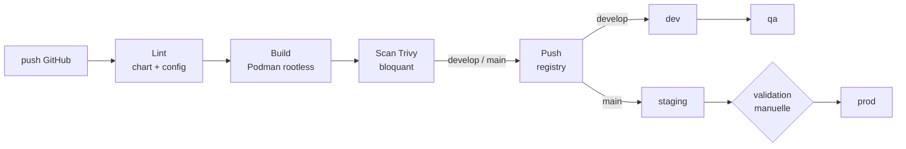
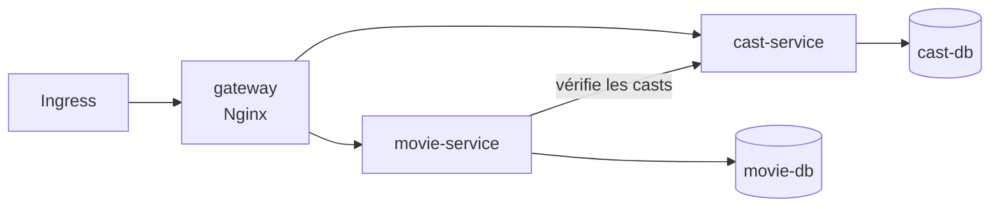

# jenkins-k8s-cicd

Pipeline CI/CD **Jenkins** pour deux microservices FastAPI, de la construction des
images au déploiement **Helm** sur quatre environnements Kubernetes, avec scan de
vulnérabilités bloquant et validation manuelle avant la production.

## Pipeline



| Branche | Étapes |
|---|---|
| toutes | lint du chart pour les 4 environnements, build des images, scan Trivy |
| `develop` | + push des images, déploiement **dev** puis **qa** |
| `main` | + push des images, déploiement **staging**, validation manuelle, **prod** |

- **Agents éphémères** : chaque build tourne dans un pod Kubernetes dédié
  ([`jenkins/agent-pod.yaml`](jenkins/agent-pod.yaml)), un conteneur par outil
  (Podman, Trivy, Helm), tous non root et sans élévation de privilèges.
- **Images sans démon ni root** : build avec Podman rootless, sans socket Docker.
- **Scan avant publication** : l'image est construite, exportée, scannée par Trivy,
  et poussée seulement si aucune vulnérabilité HIGH/CRITICAL corrigeable n'est trouvée.
- **Tags immuables** : `<commit>-<build>`, jamais `latest`. Le tag déployé est
  toujours celui qui a été scanné.
- **Déploiement atomique** : `helm upgrade --install --atomic` annule
  automatiquement une release dont les pods ne deviennent pas prêts.

## Application



Deux API FastAPI, chacune avec sa propre base PostgreSQL, derrière une passerelle
Nginx. `movie-service` vérifie auprès de `cast-service` que les acteurs référencés
existent.

## Chart Helm

[`charts/movie-app`](charts/movie-app) déploie l'ensemble, avec un fichier de values
par environnement :

| | dev | qa | staging | prod |
|---|---|---|---|---|
| Réplicas des API | 1 | 1 | 2 | 3 |
| Stockage PostgreSQL | 1 Gi | 1 Gi | 1 Gi | 10 Gi |
| Ingress TLS | — | — | ✅ | ✅ |

Le chart refuse de se déployer sans registry ni tag d'image (`required`), pour
qu'aucun déploiement ne parte avec une image implicite.

## Sécurité

| Couche | Mesure |
|---|---|
| Namespaces | Pod Security Standards en mode `restricted` sur les 4 environnements |
| Pods | non root, `readOnlyRootFilesystem`, capabilities supprimées, seccomp `RuntimeDefault`, pas de token de service monté |
| Réseau | NetworkPolicies : tout refusé par défaut, passerelle seule exposée, chaque base joignable uniquement par son service |
| Jenkins | ServiceAccount dédié, droits limités par `Role` aux 4 namespaces (aucun `ClusterRole`) |
| Secrets | identifiants de base dans des Secrets Kubernetes créés hors du dépôt, jamais dans les values |
| Images | scan Trivy bloquant, correctifs de sécurité appliqués au build, utilisateur non root |

## Mise en place

1. **Namespaces et RBAC** :
   ```bash
   kubectl apply -f k8s/namespaces.yaml -f k8s/jenkins-rbac.yaml
   ```
2. **Secrets dans chaque namespace** (`dev`, `qa`, `staging`, `prod`) :
   ```bash
   kubectl create secret docker-registry regcred -n dev \
     --docker-server=c8n.io --docker-username=<user> --docker-password=<token>
   kubectl create secret generic movie-db-credentials -n dev \
     --from-literal=username=movie --from-literal=password=<mot-de-passe> --from-literal=database=movie_db
   kubectl create secret generic cast-db-credentials -n dev \
     --from-literal=username=cast --from-literal=password=<mot-de-passe> --from-literal=database=cast_db
   ```
3. **Jenkins** : plugins Kubernetes et Pipeline, un credential `c8n-registry`
   (username/password), puis un job **Multibranch Pipeline** sur ce dépôt.
4. Adapter `REGISTRY` et `IMAGE_NAMESPACE` dans le `Jenkinsfile`, et les hôtes
   d'ingress dans `values-staging.yaml` / `values-prod.yaml`.

## Développement local

```bash
docker compose up --build
```

- http://localhost:8080/api/v1/movies/docs
- http://localhost:8080/api/v1/casts/docs

## Structure

```text
.
├── Jenkinsfile               # pipeline déclaratif
├── jenkins/agent-pod.yaml    # pod des agents (Podman, Trivy, Helm)
├── k8s/                      # namespaces et RBAC Jenkins
├── charts/movie-app/         # chart Helm + values par environnement
├── movie-service/            # API films (FastAPI)
├── cast-service/             # API acteurs (FastAPI)
├── nginx/                    # passerelle (image Docker pour compose)
└── docker-compose.yml        # environnement local
```

La configuration Nginx existe en deux exemplaires (`nginx/` pour Docker Compose,
`charts/movie-app/files/` pour Kubernetes) ; le pipeline vérifie qu'ils sont identiques.

## Crédits

Les deux microservices proviennent d'une application de démonstration utilisée comme
support d'exercice ; ils ont été mis à jour (FastAPI, Pydantic 2, SQLAlchemy 2,
Python 3.12) et corrigés. Le travail présenté ici porte sur la chaîne CI/CD et le
déploiement.
